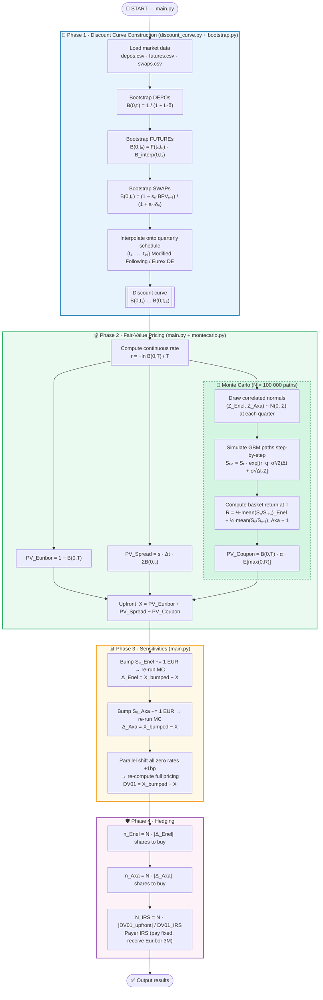

# Structured Bond Pricing

> **Final project — Advanced Mathematical Models in Finance**
> Pricing and risk-managing a 4-year equity-linked structured note written on a basket of two stocks (Enel & Axa), using Bootstrap curve construction, correlated geometric Brownian motion via Monte Carlo, bump-and-revalue Greeks, and IR DV01 hedging.

---

## Table of Contents

1. [Product Description](#1-product-description)
2. [Mathematical Framework](#2-mathematical-framework)
   - 2.1 [Discount Curve Bootstrap](#21-discount-curve-bootstrap)
   - 2.2 [Upfront Pricing Formula](#22-upfront-pricing-formula)
   - 2.3 [Monte Carlo Simulation — Correlated GBM](#23-monte-carlo-simulation--correlated-gbm)
   - 2.4 [Basket Coupon Payoff](#24-basket-coupon-payoff)
3. [Greeks & Sensitivities](#3-greeks--sensitivities)
   - 3.1 [Equity Delta — Bump & Revalue](#31-equity-delta--bump--revalue)
   - 3.2 [Interest Rate DV01 — Parallel Shift](#32-interest-rate-dv01--parallel-shift)
4. [Hedging Strategy](#4-hedging-strategy)
5. [Flow of Events](#5-flow-of-events)
6. [Module Reference](#6-module-reference)
7. [Data Inputs](#7-data-inputs)
8. [Installation & Usage](#8-installation--usage)

---

## 1. Product Description

The instrument is a **4-year capital-protected structured note** with the following cash-flow structure:

| Leg | Description | Frequency |
|-----|-------------|-----------|
| **Floating Receiver** | 3-month Euribor (flat) | Quarterly, 16 periods |
| **Spread Receiver** | Fixed spread $s = 3\%$ on notional | Quarterly, 16 periods |
| **Structured Coupon** | $\alpha \cdot \max(0,\,R_{\text{basket}})$ at maturity | Once, at $T = 4\,\text{yr}$ |

The investor pays an **upfront fee $X\%$** in exchange for these three legs. At inception the contract is fair (NPV = 0), so $X$ is determined by discounting all cash flows to $t=0$.

---

## 2. Mathematical Framework

### 2.1 Discount Curve Bootstrap

The risk-free discount curve $\{B(0, t_i)\}_{i=1}^{16}$ is built sequentially from three market instrument classes, each calibrated to their natural day-count convention.

#### Deposit instruments

For a deposit with LIBOR rate $L(0, t_i)$ under ACT/360:

$$B_{\text{depo}}(0, t_i) = \frac{1}{1 + L(0,t_i)\cdot\delta_i^{\text{ACT/360}}}$$

where $\delta_i$ is the year-fraction from settlement to maturity $t_i$.

#### Interest Rate Futures (Convexity-Adjusted Forwards)

Each futures contract implies a forward discount factor between its settlement date $t_s$ and expiry date $t_e$:

$$F(t_s, t_e) = \frac{1}{1 + f_{\text{mid}} \cdot \delta^{\text{ACT/360}}(t_s, t_e)}$$

The spot discount at $t_e$ is obtained by chaining through the already-known discount at $t_s$, which is itself linearly interpolated from previously bootstrapped pillars:

$$B(0, t_e) = F(t_s, t_e) \cdot B^{\text{interp}}(0, t_s)$$

The interpolation of $B(0, t_s)$ is performed on **continuously-compounded zero rates** to avoid arbitrage:

$$r(0, t) = -\frac{\ln B(0, t)}{t}, \qquad B^{\text{interp}}(0, \tau) = e^{-r^{\text{interp}}(\tau)\cdot\tau}$$

where $r^{\text{interp}}(\tau)$ is a linear interpolation of zero rates using ACT/365 Fixed year-fractions.

#### Swap instruments (bootstrapped iteratively)

For a fixed-for-floating swap with fixed rate $s_n$ and payment dates $\{t_1,\ldots,t_n\}$ under 30E/360, the par condition (NPV = 0 at inception) is:

$$s_n \cdot \text{BPV}_n = 1 - B(0, t_n)$$

where the **Basis Point Value** is built up recursively:

$$\text{BPV}_n = \text{BPV}_{n-1} + \delta_n^{30/360} \cdot B(0, t_n)$$

Solving for the unknown terminal discount factor $B(0, t_n)$:

$$B(0, t_n) = \frac{1 - s_n \cdot \text{BPV}_{n-1}}{1 + s_n \cdot \delta_n^{30/360}}$$

This is iterated for each new swap maturity, extending the curve one pillar at a time.

#### Final schedule interpolation

The 16 quarterly payment dates $\{t_1, \ldots, t_{16}\}$ for the structured note are generated with a **Modified Following** business day convention on the Eurex DE calendar. Discount factors on these exact dates are obtained by the same continuous zero-rate linear interpolation described above.

---

### 2.2 Upfront Pricing Formula

At inception, the fair value condition for the structured note is:

$$\underbrace{X}_{\text{upfront}} = \underbrace{PV_{\text{Euribor}}}_{\text{floating leg}} + \underbrace{PV_{\text{Spread}}}_{\text{spread leg}} - \underbrace{PV_{\text{Coupon}}}_{\text{structured leg}}$$

#### Floating (Euribor) leg

The present value of 3-month Euribor payments over 4 years telescopes exactly to:

$$PV_{\text{Euribor}} = \sum_{i=1}^{16} L(t_{i-1}, t_i) \cdot \delta_i \cdot B(0, t_i) = 1 - B(0, T)$$

where $T = t_{16} = 4$ years. This is the standard result for a floating rate bond starting at par.

#### Spread leg

The fixed spread $s = 3\%$ is paid quarterly with day-fraction $\Delta t = 0.25$ years:

$$PV_{\text{Spread}} = s \cdot \Delta t \cdot \sum_{i=1}^{16} B(0, t_i)$$

#### Structured coupon leg

The equity-linked coupon is a single payment at $T = 4$ years, valued by Monte Carlo:

$$PV_{\text{Coupon}} = B(0, T) \cdot \mathbb{E}^{\mathbb{Q}}\!\left[\alpha \cdot \max\!\left(0,\, R_{\text{basket}}(T)\right)\right]$$

where $\alpha = 0.95$ is a participation rate and $R_{\text{basket}}$ is defined in §2.4.

---

### 2.3 Monte Carlo Simulation — Correlated GBM

Both underlying stocks follow **Geometric Brownian Motion** under the risk-neutral measure $\mathbb{Q}$, with continuous dividends:

$$\frac{dS^{(k)}_t}{S^{(k)}_t} = \left(r - q_k\right)dt + \sigma_k\,dW^{(k)}_t, \quad k \in \{\text{Enel},\,\text{Axa}\}$$

where $r$ is the continuous risk-free rate extracted from $B(0,T)$:

$$r = -\frac{\ln B(0, T)}{T}$$

The two Brownian motions are correlated: $d\langle W^{(\text{Enel})}, W^{(\text{Axa})}\rangle_t = \rho\,dt$.

#### Exact Euler discretisation

The log-normal dynamics are simulated on a **quarterly grid** ($\Delta t = 0.25$, $n = 16$ steps) using the exact discretisation of the SDE:

$$S^{(k)}_{t_{j+1}} = S^{(k)}_{t_j} \cdot \exp\!\left[\left(r - q_k - \frac{\sigma_k^2}{2}\right)\Delta t + \sigma_k\sqrt{\Delta t}\,Z^{(k)}_j\right]$$

The correlated standard normals $\mathbf{Z}_j = (Z^{(\text{Enel})}_j,\, Z^{(\text{Axa})}_j)^{\!\top}$ are drawn jointly at each step:

$$\mathbf{Z}_j \sim \mathcal{N}\!\left(\mathbf{0},\,\Sigma\right), \qquad \Sigma = \begin{pmatrix} 1 & \rho \\ \rho & 1 \end{pmatrix}$$

**Calibrated parameters:**

| Parameter | Symbol | Enel | Axa |
|-----------|--------|------|-----|
| Initial spot | $S_0^{(k)}$ | 100 | 200 |
| Strike | $K^{(k)}$ | 100 | 200 |
| Implied volatility | $\sigma_k$ | 16.2% | 20.0% |
| Continuous dividend yield | $q_k$ | 2.5% | 2.9% |
| Correlation | $\rho$ | 40% | 40% |

---

### 2.4 Basket Coupon Payoff

The termsheet defines $S(T)$ as an **equally-weighted average of sequential period returns** across all monitoring dates:

$$S(T) = \frac{1}{d}\sum_{s=1}^{d} \left[\frac{1}{N_{\text{obs}}}\sum_{n=1}^{N_{\text{obs}}} \frac{E_s(t_n)}{E_s(t_{n-1})}\right]$$

where $d = 2$ (Enel, Axa), $N_{\text{obs}} = 16$ quarterly monitoring dates, and each ratio $E_s(t_n)/E_s(t_{n-1})$ is the gross return of stock $s$ over the $n$-th period. The basket return is therefore:

$$R_{\text{basket}}(T) = S(T) - 1 = \frac{1}{2}\left(\frac{1}{16}\sum_{n=1}^{16}\frac{S^{(\text{Enel})}_{t_n}}{S^{(\text{Enel})}_{t_{n-1}}} - 1\right) + \frac{1}{2}\left(\frac{1}{16}\sum_{n=1}^{16}\frac{S^{(\text{Axa})}_{t_n}}{S^{(\text{Axa})}_{t_{n-1}}} - 1\right)$$

This is an **Asian structure on period returns** (not a terminal price divided by a fixed strike). The coupon paid at $T$ (normalised to 1 unit of notional) is:

$$C(T) = \alpha \cdot \max\!\left(0,\, R_{\text{basket}}(T)\right), \qquad \alpha = 0.95$$

Its risk-neutral present value is estimated via Monte Carlo:

$$PV_{\text{Coupon}} = B(0,T) \cdot \frac{\alpha}{N_{\text{sim}}}\sum_{i=1}^{N_{\text{sim}}} \max\!\left(0,\, R_{\text{basket}}^{(i)}(T)\right)$$

where $N_{\text{sim}}$ is the number of simulated paths (default: $N_{\text{sim}} = 100{,}000$).

---

## 3. Greeks & Sensitivities

### 3.1 Equity Delta — Bump & Revalue

The **equity delta** with respect to each stock is computed by a finite-difference bump-and-revalue:

$$\Delta^{(k)} = \frac{X\!\left(S_0^{(k)} + \epsilon\right) - X\!\left(S_0^{(k)}\right)}{\epsilon}$$

with bump size $\epsilon = +1$ (EUR), applied to one stock at a time, holding the other constant.

| Sensitivity | Bump | Interpretation |
|---|---|---|
| $\Delta^{(\text{Enel})}$ | $S_0^{(\text{Enel})} = 101$ | Change in upfront $X$ per +1 EUR move in Enel |
| $\Delta^{(\text{Axa})}$ | $S_0^{(\text{Axa})} = 201$ | Change in upfront $X$ per +1 EUR move in Axa |

For the structured bond receiver, a rise in either stock increases the expected coupon $PV_{\text{Coupon}}$ and therefore **decreases** $X$ (the upfront paid).

---

### 3.2 Interest Rate DV01 — Parallel Shift

The **DV01** (Dollar Value of 1 basis point) is computed via a **parallel upward shift** of the entire yield curve by $\epsilon_r = 1\,\text{bp} = 0.0001$:

For each pillar $t_i$ on the bootstrapped curve, the bumped zero rate and discount factor are:

$$\tilde{r}_i = r_i + \epsilon_r = -\frac{\ln B(0, t_i)}{t_i} + 0.0001$$

$$\tilde{B}(0, t_i) = e^{-\tilde{r}_i \cdot t_i}$$

The full pricing is re-run with these bumped discount factors:

$$\text{DV01}_{\text{upfront}} = \tilde{X} - X$$

This captures the combined sensitivity of all three legs to a parallel shift of the yield curve.

---

## 4. Hedging Strategy

Given a notional $N$ and the computed sensitivities, the following hedges neutralise the three main risk factors:

#### Equity hedge (Delta hedging)

To delta-hedge Enel and Axa exposure, one purchases shares in the spot market:

$$n^{(k)}_{\text{shares}} = N \cdot \left|\Delta^{(k)}\right|, \qquad k \in \{\text{Enel},\,\text{Axa}\}$$

#### Interest rate hedge (DV01 hedge with an IRS)

The IR sensitivity is neutralised by entering a **Payer Interest Rate Swap** (pay fixed, receive 3-month Euribor). The DV01 of a unit-notional payer IRS is:

$$\text{DV01}_{\text{IRS}}^{1\,\text{EUR}} = \Delta t \cdot \epsilon_r \cdot \sum_{i=1}^{16} B(0, t_i)$$

The hedge notional is:

$$N_{\text{IRS}} = N \cdot \frac{\left|\text{DV01}_{\text{upfront}}\right|}{\text{DV01}_{\text{IRS}}^{1\,\text{EUR}}}$$

---

## 5. Flow of Events



---

## 6. Module Reference

```
structuredBondPricing/
├── main.py              — Orchestration: pricing, Greeks, hedging output
├── discount_curve.py    — Market data loading & discount curve assembly
├── bootstrap.py         — Bootstrapping primitives (depo / future / swap)
├── montecarlo.py        — Correlated GBM simulator & coupon PV estimator
├── Utilities.py         — Business-day-adjusted schedule generator
├── FinDates/
│   └── daycount.py      — Day-count conventions (ACT/360, 30E/360, ACT/365)
├── data/
│   ├── depos.csv        — Money market deposit rates (BID/ASK)
│   ├── futures.csv      — Euribor futures prices (BID/ASK)
│   ├── settles.csv      — Futures settlement & expiry dates
│   ├── swaps.csv        — Par swap rates (BID/ASK)
│   └── dt.csv           — Settlement date (TARGET calendar)
└── requirements.txt
```

### `bootstrap.py` — Key functions

| Function | Signature | Description |
|----------|-----------|-------------|
| `bootstrapDepo` | `(dtSettle, df_depo, df_futures, termDates, discounts)` | Appends deposit-implied discount pillars |
| `bootstrapFuture` | `(dtSettle, df_futures, termDates, discounts)` | Extends curve through the 7 IMM futures |
| `bootstrapSwap` | `(dtSettle, df_swaps, termDates, discounts)` | Extends curve through par swap pillars |
| `getZeroRates` | `(dates, df)` | Converts discount factors to continuously-compounded zero rates |
| `getRatesLinInterpDiscount` | `(dtSettle, dtRef, xDates, xDf)` | Interpolates $B(0, \tau)$ at any target date |

### `montecarlo.py` — Key function

```python
simulate_paths_and_coupon(
    r,              # continuous risk-free rate
    D_0_4,          # discount factor B(0, T=4)
    S0_enel=100.0,  # Enel spot (bump here for Δ_Enel)
    S0_axa=200.0,   # Axa spot  (bump here for Δ_Axa)
    vol_enel=0.162, vol_axa=0.200,
    div_enel=0.025, div_axa=0.029,
    rho=0.40,       # Enel–Axa return correlation
    dt=0.25,        # quarterly step
    n_steps=16,     # 4 years × 4 quarters
    alpha=0.95,     # participation rate
    N_sim=10000     # number of Monte Carlo paths
) -> (discounted_coupon: float, prices: np.ndarray)
```

Returns the discounted coupon PV and the full price tensor of shape `(2 assets, 17 time steps, N_sim)`.

---

## 7. Data Inputs

| File | Convention | Typical content |
|------|-----------|-----------------|
| `depos.csv` | ACT/360, mid = (BID+ASK)/2 | ON/TN/1W/2W/1M/2M/3M deposits |
| `futures.csv` | ACT/360, price = 1 − rate/100 | 7 IMM Euribor futures |
| `settles.csv` | — | Settle and expiry dates for each future |
| `swaps.csv` | 30E/360, mid = (BID+ASK)/2 | Par IRS rates 1Y through 10Y+ |
| `dt.csv` | TARGET | Settlement date `t_0` |

Pricing timestamp: **2023-01-31 10:45:00 CET** (settlement: 2 February 2023).

---

## 8. Installation & Usage

```bash
# 1. Clone the repository
git clone https://github.com/LorenzoMariani2003/structuredBondPricing.git
cd structuredBondPricing

# 2. Install Python dependencies
pip install -r requirements.txt

# 3. Run full pricing + sensitivities + hedging
python main.py
```

**Expected output (three questions):**

```
--- PRICING ---
PV Euribor:  0.xxxx
PV Spread:   0.xxxx
PV Coupon:   0.xxxx
Upfront X%:  X.XX%

--- Bump and revalue results ---
Delta Upfront X% for Enel (S0=101): ...
Delta Upfront X% for Axa  (S0=201): ...
Delta Upfront X% for 1bp bump:      ...

--- Hedging ---
Hedge Delta ENEL: Buy ... shares per 1 000 000 EUR notional
Hedge Delta AXA:  Buy ... shares per 1 000 000 EUR notional
Hedge IR Risk: Enter a Payer IRS with Notional = ... EUR
```

**Requirements:** Python ≥ 3.9, NumPy, Pandas, Matplotlib, and the bundled `FinDates` package.

---

*Course: Advanced Mathematical Models in Finance — 2026.*